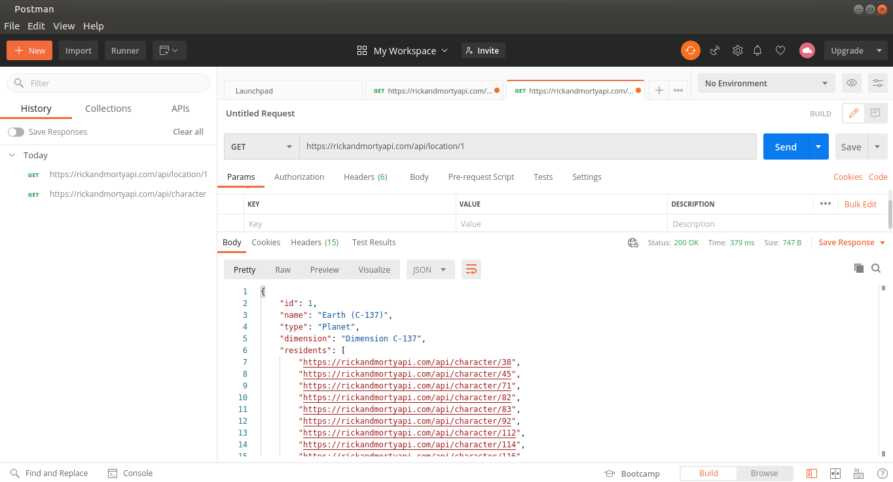

# Asincronismo-con-JavaScript

[Introducción al asincronismo](#Introducción-al-asincronismo)

[Presentación del reto](#Presentación-del-reto)

[Definición Estructura Callback](#Definición-Estructura-Callback)

[Peticiones a APIs usando Callbacks](#Peticiones-a-APIs-usando-Callbacks)

[Múltiples Peticiones a un API con Callbacks](#Múltiples-Peticiones-a-un-API-con-Callbacks)

[]()

[]()

[]()

[]()

[]()

[]()

[]()

[]()

## Introducción al asincronismo

JavaScript es un lenguaje de programacion asincrono y no bloqueante con un manejador de eventos conocido como **EventLoop** implementado en un unico hilo(thread) para sus interfaces de entrada y salida

**¿Que es asincronismo?**

Es la accion que no ocurre al mismo tiempo. 

**Ejemplo:**

En un aeropuerto hay un hilo o **thread** que es por donde llegan y salen los aviones, existe una torre de control la cual se llamaria **EventLoop**, dos aviones no se pueden recibir al mismo tiempo ni tampoco salir al mismo tiempo, tiene que existir un tiempo de espera para que uno de ellos pueda llegar o salir y despues continuar con el siguiente


**Terminos a utilizar con Js**

- **Memory heap:** Región de memoria libre, normalmente de gran tamaño, dedicada al alojamiento dinámico de objetos. Es compartida por todo el programa y controlada por un recolector de basura que se encarga de liberar aquello que no se necesita.

- **Cola o Queue:** Cada vez que nuestro programa recibe una notificación del exterior o de otro contexto distinto al de la aplicación, el mensaje se inserta en una cola de mensajes pendientes y se registra su callback correspondiente.

- **Eventloop o Loop de eventos:** Cuando la pila de llamadas (call stack) se vacía, es decir, no hay nada más que ejecutar, se procesan los mensajes de la cola. Con cada ‘tick’ del bucle de eventos, se procesa un nuevo mensaje.

- **Call Stack:** La pila de llamadas, se encarga de albergar las instrucciones que deben ejecutarse. Nos indica en que punto del programa estamos, por donde vamos.

- **CallBack:** Una función de callback es una función que se pasa a otra función como un argumento, que luego se invoca dentro de la función externa para completar algún tipo de rutina o acción.

- **Events:** Comportamientos del usuario que interactúa con una página que pueden detectarse para lanzar una acción, como por ejemplo que el usuario haga click en un elemento (onclick), que elija una opción de un desplegable (onselect), que pase el ratón sobre un objeto (onmouseover), etc.

- **Compilar:** Compilar es generar código ejecutable por una máquina, que puede ser física o abstracta como la máquina virtual de Java.

- **Transpilar:** Transpilar es generar a partir de código en un lenguaje código en otro lenguaje. Es decir, un programa produce otro programa en otro lenguaje cuyo comportamiento es el mismo que el original.

- **Hoisting:** Sugiere que las declaraciones de variables y funciones son físicamente movidas al comienzo del código en tiempo de compilación.

- **DOM:** DOM permite acceder y manipular las páginas XHTML como si fueran documentos XML. De hecho, DOM se diseñó originalmente para manipular de forma sencilla los documentos XML.

- **XML:** Lenguaje de marcado creado para la transferencia de información, legible tanto para seres humanos como para aplicaciones informáticas, y basado en una sencillez extrema y una rígida sintaxis. Así como el HTML estaba basado y era un subconjunto de SGML, la reformulación del primero bajo la sintaxis de XML dio lugar al XHTML; XHTML es, por tanto, un subconjunto de XML.

- **API:** Interfaz de programación de aplicaciones (Application Programming Interface). Es un conjunto de rutinas que provee acceso a funciones de un determinado software.

- **Concurrencia:** Cuando dos o más tareas progresan simultáneamente.

- **Paralelismo:** Cuando dos o más tareas se ejecutan, literalmente, a la vez, en el mismo instante de tiempo.

- **Bloqueante:** Una llamada u operación bloqueante no devuelve el control a nuestra aplicación hasta que se ha completado. Por tanto el thread queda bloqueado en estado de espera.

- **Síncrono:** Es frecuente emplear ‘bloqueante’ y ‘síncrono’ como sinónimos, dando a entender que toda la operación de entrada/salida se ejecuta de forma secuencial y, por tanto, debemos esperar a que se complete para procesar el resultado.

El memory heap es el espacio en memoria compartido para toda la aplicacion, luego esta la pila de ejecucion o **Call Stack** donde estaran las funciones puestas en ejecucion en forma de pila y despues va a estar la cola de tareas.

Las funciones que estan en **Call Stack** hacen un llamado a un **setTimeOut** o a alguna **API**, la cual se desencadena por medio de un **CallBack** y este va a ser puesto en la **Cola de tareas**, mientras tanto otras funciones se estan ejecutando y estan entrado y saliendo.

El **EventLoop** se encarga de preguntar si la pila de ejecucion o **Call Stack** esta vacia para luego resolver la funcion que estaba puesta en **CallBack** y luego pasa a ejecutarla y de esta forma es como continua el funcionamiento del asincronismo en JavaScript.

## Presentación del reto

Utilizar las principales estructuras que utiliza Js para trabajar con el asincronismo **(CallBacks, Promises, Async Await)**.

Consumir la API de Rick And Morty la cual contiene todos los personajes de la serie animada.


1. Obtener la lista de cuantos personajes tiene la serie.

2. Nombre del primer personaje que regrese.

3. Obtener la dimension a la cual pertenece el personaje en un tercer llamado.

La API se va a utilizar 3 veces en cada uno de los ejercicios utilizando **(CallBacks, Promises, Async Await)**, para esto es necesario entender como funciona la API y en este [enlace](https://rickandmortyapi.com/documentation) se encuentra toda la documentacion, donde se explica como esta constituida la API, cuales son los principales elementos a obtener y cuales son las caracteristicas que tiene (personajes, locacion, episodios), etc.

## Definición Estructura Callback

El **Callback** es una funcion que al crearla se le pasa como parametro una segunda funcion y de esta forma al momento de hacer una peticion o un llamado asincrono esta se ejecuta despues del llamado.

Abrir la terminal y ubicar la carpeta donde se esten realizando los proyectos.

Se inicializa el proyecto con `npm init` que permite establecer que es el proyecto y de que se va a trabajar con el 


Ahora en la carpeta del curso crear la carpeta **src**, dentro de esta crear una subcarpeta que se llame **callback** y luego dentro de esta crear un nuevo archivo que se llame **index.js**.

Lo primero que se va a hacer es crear una funcion y esta funcion se le va a pasar por parametro una segunda funcion la cual va a ejecutar codigo.

1. Se crea una funcion suma que recibe 2 parametros el cual es el numero 1 y el numero 2. La funcion como resultado regresa la suma de los 2 numeros.

2. Se crea la segunda funcion que recibe los parametros de la funcion 1 y un tercer parametro llamado callback (por convencion se coloca la palabra callback para identificar que es un callback). La funcion retorna al callback con los argumentos de la primer funcion

3. se imprime a traves de un `console.log` los parametros que recibe la funcion `calc` y se hace el llamado de la funcion 1 por parametro junto con sus parametros.

Teniendo en cuenta esto, si existiera una funcion resta, se podria ejecutar en forma de pila, primero la suma, luego la resta, etc.

```
function sum(num1, num2) {
    return num1 + num2;
}

function calc(num1, num2, callback) {
    return callback(num1,num2);
}

console.log(calc(5, 8, sum));
```

Antes de ejecutar este bloque de codigo, una buena practica es generar los scripts que permitiran ejecutar el programa de forma correcta.

abrir el archivo **package.json** y borrar la siguiente linea de codigo `"test": "echo \"Error: no test specified\" && exit 1"` reemplazar por lo siguiente `"callback": "node src/callback/index.js"`


Ahora abrir la terminal sobre la ubicacion del proyecto y ejecutar 

`npm run callback`

y en la terminal aparecera el resultado del programa


A continuacion abrir nuevamente el archivo **index.js** para seguir trabajando con ejemplos pero con tiempos y esta vez el ejemplo sera con fechas como se muestra a continuacion 

1. Se crea la function date que recibe como argumento un callback, despues imprime a traves de console.log la fecha actual es decir hoy, despues se establece un setTimeout para que exista una ejecucion del callback de 3 segundos.

2. Se crea la funcion PrintDate que pasa como parametro el nombre del callback y a traves de console.log imprime el callback

3. se llama a la funcion date con el nombre del callback

```
function date(callback) {
    console.log(new Date);
    setTimeout(function () {
        let date = new Date;
        callback(date);
    }, 3000)
}

function printDate(dateNow) {
    console.log(dateNow);
}

date(printDate);
```

Nuevamente en la terminal ejecutar `npm run callback`


Lo primero que pasa es que se imprime el primer callback que era la funcion `calc`, en segundo lugar se ejecuta la funcion date en el orden que lleva, imprime la fecha con la hora actual y 3 segundos despues como se establecio en el `setTimeout` nuevamente imprime la fecha con la llamada actual.

## Peticiones a APIs usando Callbacks

El reto es consumir la API de Rick And Morty y hacer una peticion para obtener los elementos que trae la API y despues consultar al primer personaje, despues consultar la dimension a la cual pertenece para esto en este [enlace](https://rickandmortyapi.com/api/character) esta la respuesta en formato **Json**.

Ahora lo que se va a hacer es utilizar la herramienta Postman para lo cual se deja el [enlace](https://geeksencuarentena.com/linux/como-instalar-postman-en-el-escritorio-de-linux/) de como instalar la aplicacion, esta aplicacion va a servir para analizar de una mejor forma el llamado de la API.

Despues de tener instalado Postman dar click sobre el boton + como aparece a continuacion 


y se va a desplegar esta ventana


en la parte donde esta GET pegar la url de la API que proporciona la informacion en formato **Json**


y dar click en el boton Send

despues en la parte de abajo trae toda la informacion de la API en una forma mas ordenada y mejor presentada.

Alli esta la informacion de cuantos elementos tiene, los resultados que serian los personajes de la API que se utilizaran para el proyecto


en los resultados no aparece la dimension del primer personaje, para poder revisar la dimension hay que hacer click sobre `"url": "https://rickandmortyapi.com/api/location/1"`, esto hace que se abra otra ventana y nuevamente hay que dar click sobre el boton **send**



Ahora lo que se va a hacer es crear el codigo necesario para hacer las peticiones y obtener los valores solicitados.

1. La API general

2. Primer personaje

3. Llamar la ubicacion que en este caso es obtener el valor real de la dimension del origen del personaje

en la carpeta **callback** del proyecto crear un archivo que se llame **challenge.js**

Actualmente se esta trabajando con **Node Js**, es necesario instalar la dependencia **xmlhttprequest** la cual es un objeto que esta dentro de Js, el cual permite realizar peticiones hacia algun servicio en la nube, en este caso una URL, API, etc.

Para instalar la dependencia hay que ubicar el proyecto en la terminal y ejecutar `npm install xmlhttprequest` y para instalarla como una dependencia de desarrollo se agrega `--save`


Despues de instalar la dependencia en el archivo **challenge.js** se debe instanciar esta dependencia de la siguiente forma 

```
let XMLHttpRequest = require('xmlhttprequest').XMLHttpRequest;
```

Aqui se va a aprender a utilizar **xmlhttprequest**, no se utilizara fetch porque es una implementacion que esta disponible desde **ES6(Ecma Script 6)** en adelante, fetch por dentro utiliza **promises**, como en este momento se esta trabajando con **callbacks** se trabajara como se hacia con **ES5** para ir entendiendo cada una de las fases del asincronismo en Js.

1. Crear una funcion que se llamara `fetchData` que permitira traer la informacion desde la API, la cual se le va a pasar un callback y luego desencadenar los llamados que se necesiten esta funcion recibe 2 parametros la url de la api y el callback.

2. Se crea una variable para instancia XMLHttpRequest

3. Despues de tener instanciada XMLHttpRequest con la variable ya se tiene acceso al metodo open el cual recibe como parametro, la peticion que se va a realizar que en este caso es `GET` para obtener la informacion de la url, la url de la api y el valor true que significa que se va a manejar de forma asincrona, por defecto esta en true y no es necesario colocarlo pero por convencion se deja con el estado en true

4. Se genera el estado por el cual pasa la conexion a traves del metodo onreadystatechange, si el cambio sucede entonces se ejecuta una funcion que recibe un evento, despues vienen las validaciones para saber si se va a ejecutar el callback. La validacion que se va a realizar es si el estado en el cual se encuentra es satisfactorio. Existen diferentes estados los cuales se pueden consultar para ampliar mas la informacion en el siguiente [enlace](https://www.w3schools.com/xml/ajax_xmlhttprequest_response.asp).

Son 5 estados:

    1. Se ha inicializado pero aun no ha hecho open

    2. Esta cargando y haciendo el proceso de llamado 

    3. Ya esta cargado 

    4. Si existe una descarga o informacion 

    5. Se ha completado la peticion

5. se usa la primer validacion a traves de `readyState` para validar el estado en el que se encuentra, son 5 estados pero se debe tener en cuenta que empieza desde el numero 0

6. La segunda validacion es la que permite saber el `status` en la que se encuentra la peticion, si es 200 quiere decir que todo esta Ok

7. El regreso del callback, donde su primer parametro es el error y el segundo el resultado que es la informacion que se desencadena, como la API viene en formato **JSON** se debe parsear para recibir una respuesta en texto, si no se pasa con `responseText` se va a mandar un string de texto que es un objeto y no permite iterar ni acceder a distintos valores 

8. Se manda el `else` como buena practica en caso que la peticion no se este haciendo correctamente, se configura el Error indicando el error que traiga la api y luego se regresa al callback con el error que es el primer parametro que recibe el callbak y como segundo parametro null porque en este caso no se va a regresar ningun resultado

9. Por ultimo se usa `xhttp.send();` para hacer el envio de la solicitud 

```
let XMLHttpRequest = require('xmlhttprequest').XMLHttpRequest;

function fetchData(url_api, callback) {
    let xhttp = new XMLHttpRequest();
    xhttp.open('GET', url_api, true);
    xhttp.onreadystatechange = function (event) {
        if(xhttp.readyState === 4) {
            if(xhttp.status === 200){
                callback(null, JSON.parse(xhttp.responseText))
            } else {
                const error = new Error('Error ' + url_api);
                return callback(error, null)
            }
        }
    }
    xhttp.send();
}
```

Esta es la funcion que va a dar vida a las llamadas que se tienen que hacer con la API

## Múltiples Peticiones a un API con Callbacks

Ahora hay que hacer el llamado a la funcion fetchData para poder hacer las peticiones a la API

Para esto debajo de donde se instancia `XMLHttpRequest` se crea una variable para guardar la url de la API `let API = 'https://rickandmortyapi.com/api/character/';`

1. se llama a la funcion `fetchData` que recibe como primer parametro la API, y como segundo parametro el callback que recibe como parametros un error y un resultado.

2. Se hace la validacion del error1 para el primer llamado de la API donde obtiene la identidad del primer personaje a traves de fetchData, recibe la url de la API y obtiene el resultado del primer id, luego se configura el segundo callback para obtener los datos del nombre del primer personaje y repite el mismo proceso a traves de los atributos que se debe saber de donde se obtienen analizando la informacion que brinda la aplicacion Postman y se hace el tercer llamado para obtener la dimension del personaje

3. Se imprimen cada uno de los valores solicitados a traves de un console.log

```
fetchData(API, function(error1, data1) {
    if(error1) return console.error(error1);
    fetchData(API + data1.results[0].id, function(error2, data2) {
        if(error2) return console.error(error2);
        fetchData(data2.origin.url, function(error3, data3) {
            if(error3) return console.error(error3);
            console.log(data1.info);
            console.log(data2.name);
            console.log(data3.dimension);
        });
    });
});
```

El codigo en el archivo **challenge.js** finalmente queda asi 

```
let XMLHttpRequest = require('xmlhttprequest').XMLHttpRequest;
let API = 'https://rickandmortyapi.com/api/character/';

function fetchData(url_api, callback) {
    let xhttp = new XMLHttpRequest();
    xhttp.open('GET', url_api, true);
    xhttp.onreadystatechange = function (event) {
        if(xhttp.readyState === 4) {
            if(xhttp.status === 200){
                callback(null, JSON.parse(xhttp.responseText))
            } else {
                const error = new Error('Error ' + url_api);
                return callback(error, null)
            }
        }
    }
    xhttp.send();
}

fetchData(API, function(error1, data1) {
    if(error1) return console.error(error1);
    fetchData(API + data1.results[0].id, function(error2, data2) {
        if(error2) return console.error(error2);
        fetchData(data2.origin.url, function(error3, data3) {
            if(error3) return console.error(error3);
            console.log(data1.info.count);
            console.log(data2.name);
            console.log(data3.dimension);
        });
    });
});
```

Antes de ejecutar abrir el archivo **package.json** y añadir un nuevo **script** que es el siguiente `"callback:challenge": "node src/callback/challenge.js"` los scripts quedan de esta forma, no olvidar colocar la coma **,** al final del primer callback

```
  "scripts": {
    "callback": "node src/callback/index.js",
    "callback:challenge": "node src/callback/challenge.js"
  },
```

Ahora ubicados en el proyecto sobre la terminal ejecutar `npm run callback:challenge`


De esta forma trae que la API tiene

- 671 personajes
- Primer personaje es Rick Sanchez
- La dimension de Rick Sanchez es C-137

Una recomendacion importante es evitar caer en un callback hell, lo cual es una anidacion de callbacks tras anidacion tras anidacion 


Lo mejor que se puede hacer es tener un maximo de 3 callback y en caso de que se requiera hacer anidacion de mas callback analizar muy bien la situacion ya que no es una buena practica 